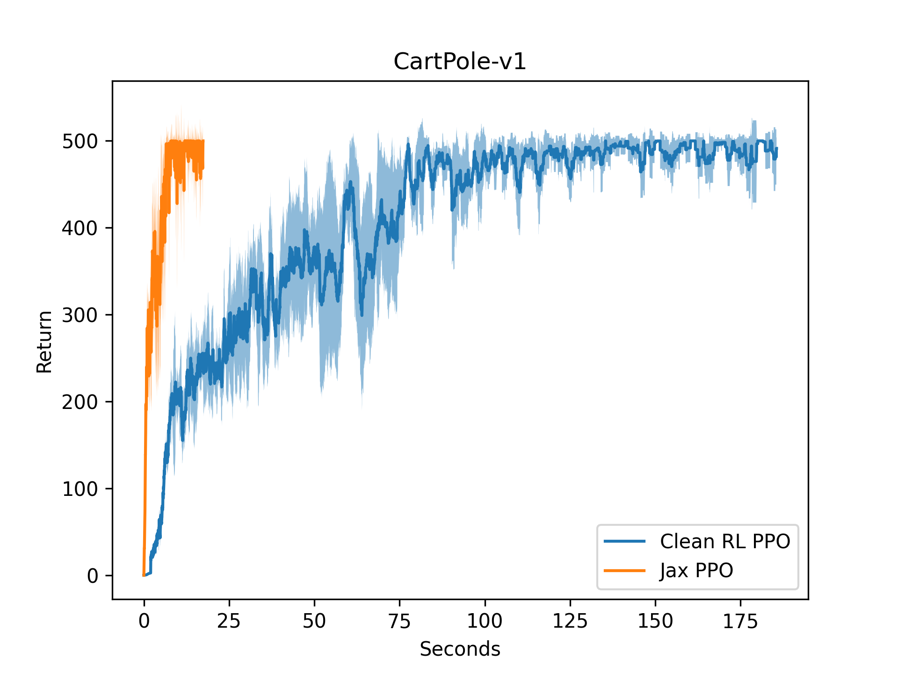
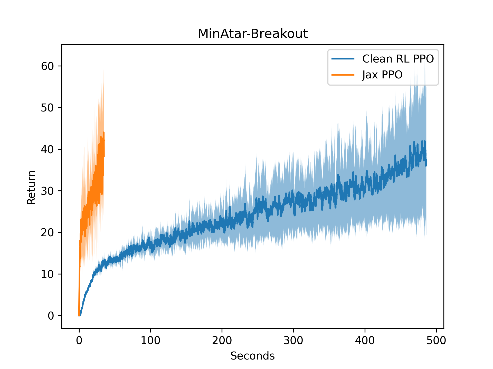
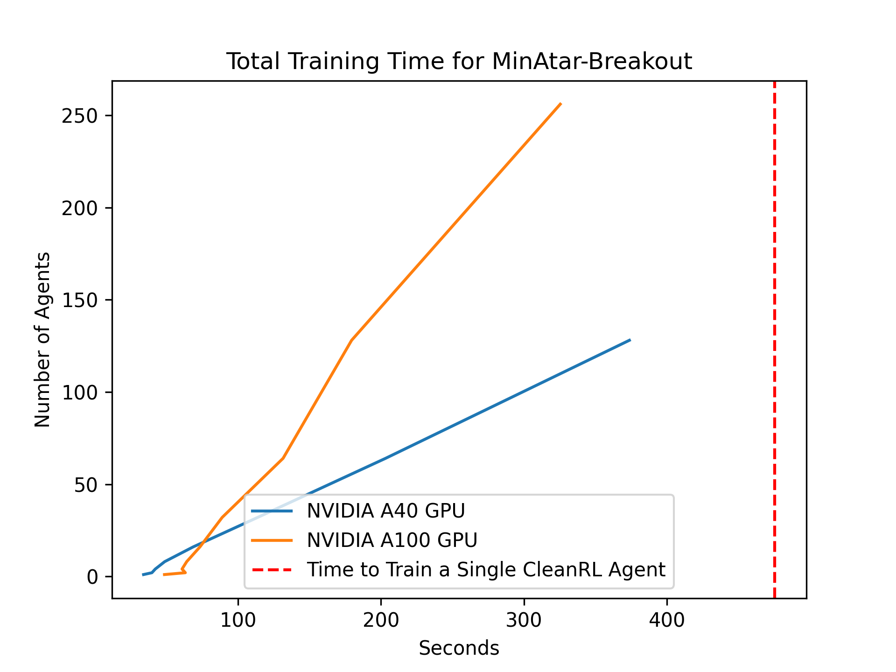

# PureJaxRL (End-to-End RL Training in Pure Jax)

[](https://github.com/luchris429/purejaxrl)
[](https://github.com/psf/black)
[](https://colab.research.google.com/github/luchris429/purejaxrl/blob/main/examples/example_0.ipynb)

PureJaxRL is a high-performance, end-to-end Jax Reinforcement Learning (RL) implementation. When running many agents in parallel on GPUs, our implementation is over 1000x faster than standard PyTorch RL implementations. Unlike other Jax RL implementations, we implement the *entire training pipeline in JAX*, including the environment. This allows us to get significant speedups through JIT compilation and by avoiding CPU-GPU data transfer. It also results in easier debugging because the system is fully synchronous. More importantly, this code allows you to use jax to `jit`, `vmap`, `pmap`, and `scan` entire RL training pipelines. With this, we can:

- 🏃 Efficiently run tons of seeds in parallel on one GPU
- 💻 Perform rapid hyperparameter tuning
- 🦎 Discover new RL algorithms with meta-evolution

For more details, visit the accompanying blog post: https://chrislu.page/blog/meta-disco/

This notebook walks through the basic usage: [](https://colab.research.google.com/github/luchris429/purejaxrl/blob/main/examples/example_0.ipynb)

## Performance

Without vectorization, our implementation runs 10x faster than [CleanRL's PyTorch baselines](https://github.com/vwxyzjn/cleanrl/blob/master/cleanrl/ppo.py), as shown in the single-thread performance plot.

Cartpole                   |  Minatar-Breakout
:-------------------------:|:-------------------------:
  |  


With vectorized training, we can train 2048 PPO agents in half the time it takes to train a single PyTorch PPO agent on a single GPU. The vectorized agent training allows for simultaneous training across multiple seeds, rapid hyperparameter tuning, and even evolutionary Meta-RL. 

Vectorised Cartpole        |  Vectorised Minatar-Breakout
:-------------------------:|:-------------------------:
  |  


## Code Philosophy

PureJaxRL is inspired by [CleanRL](https://github.com/vwxyzjn/cleanrl), providing high-quality single-file implementations with research-friendly features. Like CleanRL, this is not a modular library and is not meant to be imported. The repository focuses on simplicity and clarity in its implementations, making it an excellent resource for researchers and practitioners.

## Installation

Install dependencies using the requirements.txt file:

```
pip install -r requirements.txt
```

## Example Usage

[`examples/example_0.ipynb`](https://github.com/luchris429/purejaxrl/blob/main/examples/example_0.ipynb) walks through the basic usage. 

You can open it directly in colab using this: [](https://colab.research.google.com/github/luchris429/purejaxrl/blob/main/examples/example_0.ipynb)

## TODOs

The following improvements are planned for the PureJaxRL repository:

1. More memory-efficient logging
2. Integration with Weights & Biases (WandB) for experiment tracking
3. Continuous PPO for Brax
5. Connecting to non-Jax environments like envpool

## Related Work

PureJaxRL builds upon other tools in the Jax and RL ecosystems. Check out the following projects:

- Gymnax (https://github.com/RobertTLange/gymnax)
- Evosax (https://github.com/RobertTLange/evosax)
- CleanRL (https://github.com/vwxyzjn/cleanrl)
- Brax (https://github.com/google/brax)
- Jumanji (https://github.com/instadeepai/jumanji)

## Citation

If you use PureJaxRL in your work, please cite the following paper:

```
@article{lu2022discovered,
    title={Discovered policy optimisation},
    author={Lu, Chris and Kuba, Jakub and Letcher, Alistair and Metz, Luke and Schroeder de Witt, Christian and Foerster, Jakob},
    journal={Advances in Neural Information Processing Systems},
    volume={35},
    pages={16455--16468},
    year={2022}
}
```