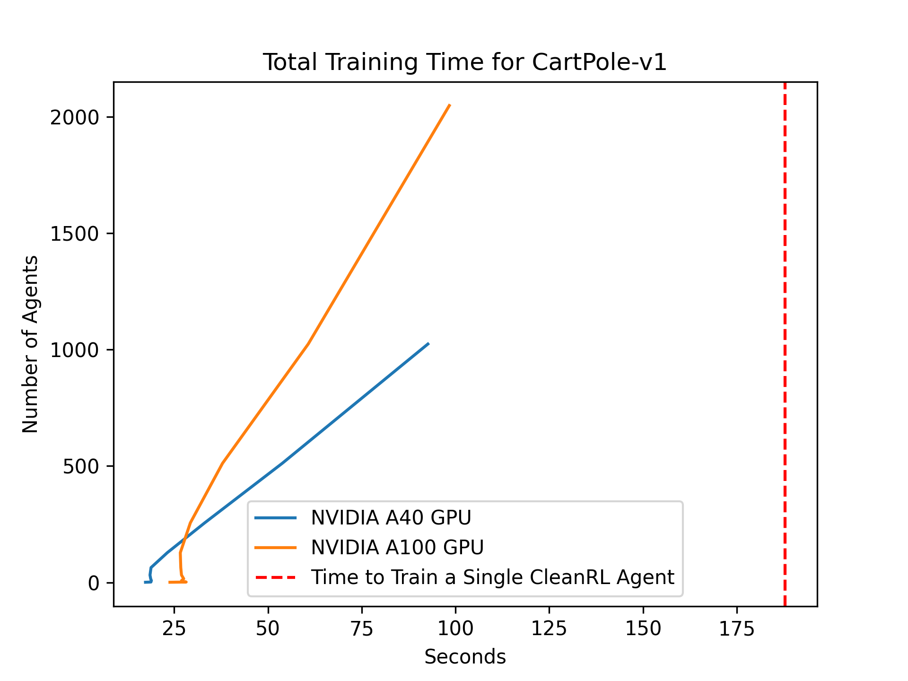

# JitRL (End-to-End RL Algortihms in Pure Jax)

[](https://github.com/luchris429/jitrl)
[](https://github.com/psf/black)
[](https://colab.research.google.com/github/luchris429/jitrl/blob/main/examples/example_0.ipynb)

JitRL is a high-performance, end-to-end Jax Reinforcement Learning (RL) implementation. By running entirely on the accelerator, including the environment, we leverage Jax's vectorization capabilities and overcome the bottlenecks of CPU-GPU data transfer and Python overhead. This results in significant speedups, easier debugging, and fully synchronous operation. This code allows you to use jax to `jit`, `vmap`, `pmap`, and `scan` entire RL training pipelines. For more details, visit the accompanying blog post: https://chrislu.page/blog/meta-disco/

This notebook walks through the basic usage: [](https://colab.research.google.com/github/luchris429/jitrl/blob/main/examples/example_0.ipynb)

## Performance

Our implementation runs 10x faster than [CleanRL's PyTorch baselines](https://github.com/vwxyzjn/cleanrl/blob/master/cleanrl/ppo.py), as shown in the single-thread performance plot.

Cartpole                   |  Minatar-Breakout
:-------------------------:|:-------------------------:
  |  


The vectorized agent training allows for simultaneous training across multiple seeds, rapid hyperparameter tuning, and even evolutionary Meta-RL. With vectorized training, we can train 2048 PPO agents in half the time it takes to train a single PyTorch PPO agent.

Cartpole                   |  Minatar-Breakout
:-------------------------:|:-------------------------:
  |  


## Code Philosophy

JitRL is inspired by [CleanRL](https://github.com/vwxyzjn/cleanrl), providing high-quality single-file implementations with research-friendly features. Like CleanRL, this is not a modular library and is not meant to be imported. The repository focuses on simplicity and clarity in its implementations, making it an excellent resource for researchers and practitioners.

## Installation

Install dependencies using the requirements.txt file:

pip install -r requirements.txt

## Example Usage

[`examples/example_0.ipynb`](https://github.com/luchris429/jitrl/blob/main/examples/example_0.ipynb) walks through the basic usage. 

You can open it directly in colab using this: [](https://colab.research.google.com/github/luchris429/jitrl/blob/main/examples/example_0.ipynb)

## TODOs

The following improvements are planned for the JitRL repository:

1. More memory-efficient logging
2. Integration with Weights & Biases (WandB) for experiment tracking
3. Continuous PPO for Brax
5. Connecting to non-Jax environments like envpool

## Related Work

JitRL builds upon other tools in the Jax and RL ecosystems. Check out the following projects:

- Gymnax (https://github.com/RobertTLange/gymnax)
- Evosax (https://github.com/RobertTLange/evosax)
- CleanRL (https://github.com/vwxyzjn/cleanrl)
- Brax (https://github.com/google/brax)
- Jumanji (https://github.com/instadeepai/jumanji)

## Citation

If you use JitRL in your work, please cite the following paper:

```
@article{lu2022discovered,
    title={Discovered policy optimisation},
    author={Lu, Chris and Kuba, Jakub and Letcher, Alistair and Metz, Luke and Schroeder de Witt, Christian and Foerster, Jakob},
    journal={Advances in Neural Information Processing Systems},
    volume={35},
    pages={16455--16468},
    year={2022}
}
```